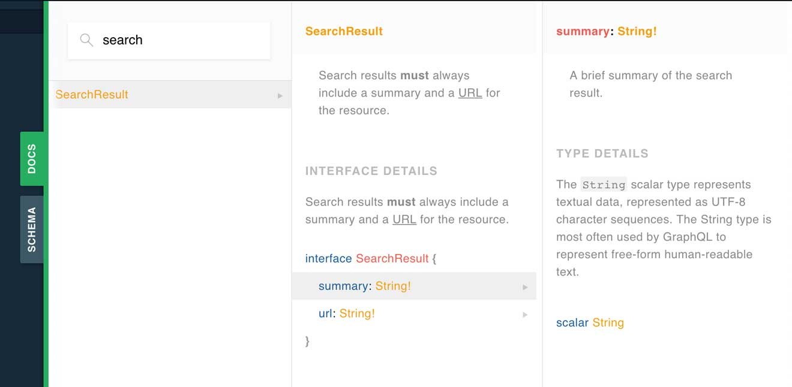

The GraphQL specification includes two features that make documentation and schema exploration easy and powerful.  Those features are descriptions and introspection queries.

There is now a rich ecosystem of tools built on top of those features.  Some of which include IDE plugins, code generators and interactive API explorers.


## GraphQL Playground

Ariadne ships with [GraphQL Playground](https://github.com/prisma/graphql-playground), a popular interactive API explorer.

GraphQL Playground allows developers and clients to explore the relationships between types across your schema in addition to reading detail about individual types.




## Descriptions

The GraphQL schema definition language supports a special [description syntax](https://facebook.github.io/graphql/June2018/#sec-Descriptions). This allows you to provide additional context and information alongside your type definitions, which will be accessible both to developers and API consumers.

GraphQL descriptions are declared using a format that feels very similar to Python's `docstrings`:

```python
query = '''
    """
    Search results must always include a summary and a URL for the resource.
    """
    interface SearchResult {
        "A brief summary of the search result."
        summary: String!

        "The URL for the resource the search result is describing."
        url: String!
    }
'''
```

Note that GraphQL descriptions also support Markdown (as specified in [CommonMark](https://commonmark.org/)):

```python
query = '''
    """
    Search results **must** always include a summary and a
    [URL](https://en.wikipedia.org/wiki/URL) for the resource.
    """
    interface SearchResult {
        # ...
    }
'''
```


## Introspection Queries

The GraphQL specification also defines a programmatic way to learn about a server's schema and documentation.  This is called [introspection](https://graphql.org/learn/introspection/).

The `Query` type in a GraphQL schema also includes special introspection fields (prefixed with a double underscore) which allow a user or application to ask for information about the schema itself:

```graphql
query IntrospectionQuery {
    __schema {
        types {
            kind
            name
            description
        }
    }
}
```

The result of the above query might look like this:

```json
{
    "__schema": {
        "types": [
            {
                "kind": "OBJECT",
                "name": "Query",
                "description": "A simple GraphQL schema which is well described.",
            }
        ]
    }
}
```

> Tools like GraphQL Playground use introspection queries internally to provide the live, dynamic experiences they do.
